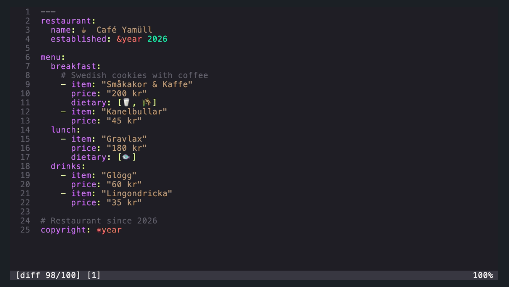
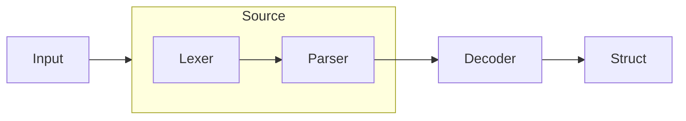

<p align="center">
  <h1 align="center">Nice YAML!</h1>
</p>

<p align="center">
  <a href="https://pkg.go.dev/jacobcolvin.com/niceyaml"></a>
  <a href="https://goreportcard.com/report/jacobcolvin.com/niceyaml"></a>
  <a href="https://codecov.io/gh/macropower/niceyaml"></a>
  <a href="#-installation"></a>
  <a href="https://github.com/macropower/niceyaml/blob/main/LICENSE"></a>
</p>

Package `niceyaml` combines the powers of [go-yaml][goccy/go-yaml], [bubbletea][bubbletea], and more.

It enables **friendly and predictable handling of YAML-compatible documents** in your **CLI** or **TUI** applications, and includes:

- [`Source`][niceyaml.Source] **style overlay** and **annotation** system
- Pretty [`Printer`][niceyaml.Printer] with [themes][niceyaml/style/theme]
- Rich [`Error`][niceyaml.Error] display using the above systems
- Source [`Revision`][niceyaml.Revision]s for file lineage and **diffs**
- String [`Finder`][niceyaml.Finder] for load-once, search-many scenarios
- Extended [`Encoder`][niceyaml.Encoder] and [`Decoder`][niceyaml.Decoder] wrappers
- JSON schema [`generator`][niceyaml/schema/generator] and [`validator`][niceyaml/schema/validator]
- Bubble [`yamlviewport`][niceyaml/bubbles/yamlviewport] for Bubble Tea
- Generic building blocks for your own bubbles

We use a **parse-once**, **style-once** approach. This means your users get a snappy UI, and you get a simple API. There's no need to employ multiple lexers, or perform any ANSI manipulation!

We also provide a consistent **positioning system** used throughout `niceyaml`. It enables each cell to be individually addressed, without any complexity being introduced by the specific display mode (e.g. diffs, slices).

## Features

### Search


### Revision Diffs



### Themes


### Validation


## Installation

```sh
go get jacobcolvin.com/niceyaml@latest
```

## Usage

### Core Abstractions

Package `niceyaml` adds a few abstractions on top of [go-yaml][goccy/go-yaml]:

- `Line` - Tokens for a single line of YAML content
- `Lines` - Collection of `Line`s representing one or more YAML documents
- `Source` - Manages `Lines` while abstracting away go-yaml lexer/parser details

Most use cases will only need to interact with `Source`. It satisfies most interfaces accepted by other niceyaml utilities.

These abstractions enable straightforward iteration over arbitrary lines of tokens from one or more YAML documents, while maintaining the original token details from the lexer. It cleanly solves common problems introduced by multi-line and/or overlapping tokens in diffs, partial rendering, and/or search.



### Printing YAML with Lipgloss Styles

- [examples/printer](examples/printer)

### Printing Diffs Between YAML Revisions

- [examples/diffs](examples/diffs)

### Searching YAML Content

- [examples/finder](examples/finder)

### Schema Generation and Validation

- [examples/schemas/cafe](examples/schemas/cafe)

### Full YAML Viewport Example

See [cmd/nyaml](cmd/nyaml) for a complete Bubble Tea application that loads, pages, searches, diffs, and validates YAML documents.

[goccy/go-yaml]: https://github.com/goccy/go-yaml
[lipgloss]: https://github.com/charmbracelet/lipgloss
[bubbletea]: https://github.com/charmbracelet/bubbletea
[invopop/jsonschema]: https://github.com/invopop/jsonschema
[santhosh-tekuri/jsonschema]: https://github.com/santhosh-tekuri/jsonschema
[niceyaml.Error]: https://pkg.go.dev/jacobcolvin.com/niceyaml#Error
[niceyaml.Encoder]: https://pkg.go.dev/jacobcolvin.com/niceyaml#Encoder
[niceyaml.Decoder]: https://pkg.go.dev/jacobcolvin.com/niceyaml#Decoder
[niceyaml.Finder]: https://pkg.go.dev/jacobcolvin.com/niceyaml#Finder
[niceyaml.Printer]: https://pkg.go.dev/jacobcolvin.com/niceyaml#Printer
[niceyaml.Revision]: https://pkg.go.dev/jacobcolvin.com/niceyaml#Revision
[niceyaml.Source]: https://pkg.go.dev/jacobcolvin.com/niceyaml#Source
[niceyaml/style/theme]: https://pkg.go.dev/jacobcolvin.com/niceyaml/style/theme
[niceyaml/style.Style]: https://pkg.go.dev/jacobcolvin.com/niceyaml/style#Style
[niceyaml/bubbles/yamlviewport]: https://pkg.go.dev/jacobcolvin.com/niceyaml/bubbles/yamlviewport
[niceyaml/schema/generator]: https://pkg.go.dev/jacobcolvin.com/niceyaml/schema/generator
[niceyaml/schema/validator]: https://pkg.go.dev/jacobcolvin.com/niceyaml/schema/validator
