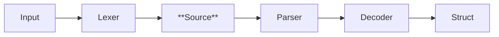

<p align="center">
  <h1 align="center">Nice YAML!</h1>
</p>

<p align="center">
  <a href="https://pkg.go.dev/github.com/macropower/niceyaml"></a>
  <a href="https://goreportcard.com/report/github.com/macropower/niceyaml"></a>
  <a href="https://codecov.io/gh/macropower/niceyaml"></a>
  <a href="#-installation"></a>
  <a href="https://github.com/macropower/niceyaml/blob/main/LICENSE"></a>
</p>

Package `niceyaml` combines the powers of [go-yaml][goccy/go-yaml], [bubbletea][bubbletea], and more.

It enables **friendly and predictable handling of YAML documents** in your **CLI** or **TUI** applications.

> Also supports all YAML-compatible document formats like KYAML or JSON.


## Features

### Pretty Printing

- Render YAML with syntax highlighting via [lipgloss][lipgloss], directly from tokenized input
- Wrap YAML errors from go-yaml's parser with fully styled source annotations
- Supports custom color schemes, style overlays (e.g. highlights), diff rendering, and more

### JSON Schema Generation & Validation

1. Generate JSON schemas from structs via [invopop/jsonschema][invopop/jsonschema]
2. Provide generated schemas to users, include them via embedding
3. Use your JSON schemas to validate the Generators via [santhosh-tekuri/jsonschema][santhosh-tekuri/jsonschema]
4. Users receive the same feedback from your application and their YAML language server!

## Installation

```sh
go get github.com/macropower/niceyaml@latest
```

## Usage

### Core Abstractions

Package `niceyaml` primarily adds two abstractions on top of [go-yaml][goccy/go-yaml]:

- `Line` - Tokens for a single line of YAML content
- `Source` - A full YAML document, consisting of multiple `Line`s

These abstractions can be considered intermediate constructs between go-yaml's tokens (from lexer) and AST nodes (from parser).

This intermediate type allows us to build utilities that iterate over lines of tokens, such as pretty printers, diffing systems, search utilities, and error handling. All while maintaining the original token details from the lexer, and avoiding unnecessary work (e.g. re-parsing or re-rendering unnecessary parts of the document).



In practice, `niceyaml` exposes some convenience functions to make integration easier.

### Printing YAML with Lipgloss Styles

```go
source := niceyaml.NewSourceFromString(`
foo: bar
baz: qux
list:
  - item1
  - item2
`)

printer := niceyaml.NewPrinter(
  // niceyaml.WithStyles(...),
)

// Print with syntax highlighting to stdout.
fmt.Println(printer.Print(source))
// 1 foo: bar
// 2 baz: qux
// 3 list:
// 4   - item1
// 5   - item2

// Or, only render the lines you need.
fmt.Println(printer.PrintSlice(source, 0, 2))
// 1 foo: bar
// 2 baz: qux
```

### Printing Diffs Between YAML Revisions

```go
// Create an initial revision.
rev := niceyaml.NewRevision(niceyaml.NewSourceFromString("foo: bar"))

// Append a new revision.
rev = rev.Append(niceyaml.NewSourceFromString("baz: qux"))

// Create a full diff between the two revisions.
diff := niceyaml.NewFullDiff(rev.Origin(), rev.Tip())

printer := niceyaml.NewPrinter()

// Print the full diff with syntax highlighting to stdout.
fmt.Println(printer.Print(diff))
// 1 - foo: bar
// 1 + baz: qux
```

### Parsing YAML Input

```go
source := niceyaml.NewSourceFromString(yamlInput)

// Parse into go-yaml AST nodes with niceyaml.Error support.
file, err := source.Parse()
if err != nil {
	// This is a niceyaml.Error with annotations.
	return err
}
```

### Validating and Decoding YAML Documents

```go
// Create a niceyaml.Decoder with your go-yaml *ast.File (created above).
decoder := niceyaml.NewDecoder(file)

// Create JSON Schema validators for different resource kinds.
deployValidator := validate.MustNewValidator("https://raw.githubusercontent.com/yannh/kubernetes-json-schema/refs/heads/master/master/deployment-apps-v1.json", deployJSONSchema)
svcValidator := validate.MustNewValidator("https://raw.githubusercontent.com/yannh/kubernetes-json-schema/refs/heads/master/master/service-v1.json", svcJSONSchema)

// Iterate over all documents in the input.
for _, doc := range decoder.Documents() {
	// Use GetValue to extract specific fields prior to full decoding.
	// For example, we can switch on "kind" to decode different Kubernetes resources.
	kind, ok := doc.GetValue(niceyaml.NewPath("kind"))
	if !ok {
		continue
	}

	// Validate and decode based on kind.
	// All of the errors below are niceyaml.Errors with annotations.
	switch kind {
	case "Deployment":
		if err := doc.Validate(deployValidator); err != nil {
			return err
		}
		var deploy appsv1.Deployment
		if err := doc.Decode(&deploy); err != nil {
			return err
		}

	case "Service":
		if err := doc.Validate(svcValidator); err != nil {
			return err
		}
		var svc corev1.Service
		if err := doc.Decode(&svc); err != nil {
			return err
		}

	default:
		// ...
	}
}
```

[goccy/go-yaml]: https://github.com/goccy/go-yaml
[lipgloss]: https://github.com/charmbracelet/lipgloss
[bubbletea]: https://github.com/charmbracelet/bubbletea
[invopop/jsonschema]: https://github.com/invopop/jsonschema
[santhosh-tekuri/jsonschema]: https://github.com/santhosh-tekuri/jsonschema
