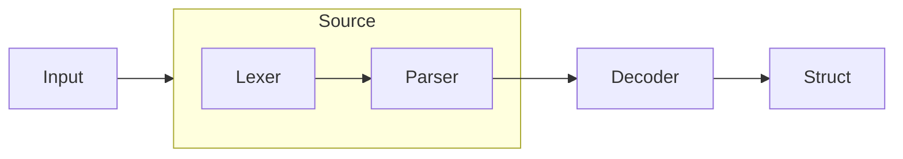

<p align="center">
  <h1 align="center">Nice YAML!</h1>
</p>

<p align="center">
  <a href="https://pkg.go.dev/github.com/macropower/niceyaml"></a>
  <a href="https://goreportcard.com/report/github.com/macropower/niceyaml"></a>
  <a href="https://codecov.io/gh/macropower/niceyaml"></a>
  <a href="#-installation"></a>
  <a href="https://github.com/macropower/niceyaml/blob/main/LICENSE"></a>
</p>

Package `niceyaml` combines the powers of [go-yaml][goccy/go-yaml], [bubbletea][bubbletea], and more.

It enables **friendly and predictable handling of YAML documents** in your **CLI** or **TUI** applications.

> Also supports all YAML-compatible document formats like KYAML or JSON.


## Features

### Pretty Printing

- Render YAML with syntax highlighting via [lipgloss][lipgloss], directly from tokenized input
- Wrap YAML errors from go-yaml's parser with fully styled source annotations
- Supports custom color schemes, style overlays (e.g. highlights), diff rendering, and more

### JSON Schema Generation & Validation

1. Generate JSON schemas from structs via [invopop/jsonschema][invopop/jsonschema]
2. Provide generated schemas to users, include them via embedding
3. Use your JSON schemas to validate the Generators via [santhosh-tekuri/jsonschema][santhosh-tekuri/jsonschema]
4. Users receive the same feedback from your application and their YAML language server!

## Installation

```sh
go get github.com/macropower/niceyaml@latest
```

## Usage

### Core Abstractions

Package `niceyaml` adds a few abstractions on top of [go-yaml][goccy/go-yaml]:

- `Line` - Tokens for a single line of YAML content
- `Lines` - Collection of `Line`s representing one or more YAML documents
- `Source` - Manages `Lines` while abstracting away go-yaml lexer/parser details

Most use cases will only need to interact with `Source`. It satisfies most interfaces accepted by other niceyaml utilities.

These abstractions enable straightforward iteration over arbitrary lines of tokens from one or more YAML documents, while maintaining the original token details from the lexer. It cleanly solves common problems introduced by multi-line and/or overlapping tokens in diffs, partial rendering, and/or search.



### Printing YAML with Lipgloss Styles

- [examples/printer](examples/printer)

### Printing Diffs Between YAML Revisions

- [examples/diffs](examples/diffs)

### Searching YAML Content

- [examples/finder](examples/finder)

### Schema Generation and Validation

- [examples/schemas/cafe](examples/schemas/cafe)

[goccy/go-yaml]: https://github.com/goccy/go-yaml
[lipgloss]: https://github.com/charmbracelet/lipgloss
[bubbletea]: https://github.com/charmbracelet/bubbletea
[invopop/jsonschema]: https://github.com/invopop/jsonschema
[santhosh-tekuri/jsonschema]: https://github.com/santhosh-tekuri/jsonschema
