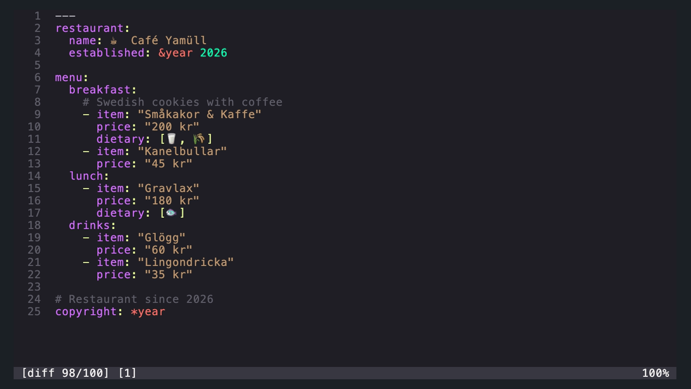
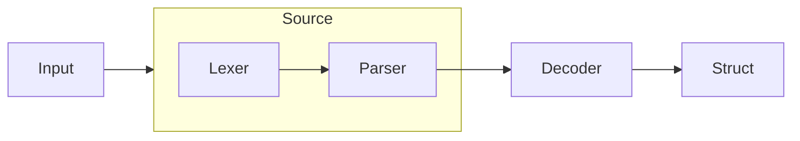

<p align="center">
  <h1 align="center">Nice YAML!</h1>
</p>

<p align="center">
  <a href="https://pkg.go.dev/go.jacobcolvin.com/niceyaml"></a>
  <a href="https://goreportcard.com/report/go.jacobcolvin.com/niceyaml"></a>
  <a href="https://codecov.io/gh/macropower/niceyaml"></a>
  <a href="#-installation"></a>
  <a href="https://github.com/macropower/niceyaml/blob/main/LICENSE"></a>
</p>

Package `niceyaml` combines the powers of [go-yaml][goccy/go-yaml], [bubbletea][bubbletea], and more.

It enables **friendly and predictable handling of YAML-compatible documents** in your **CLI** or **TUI** applications, and includes:

- [`Source`][niceyaml.Source] **style overlay** and **annotation** system
- Pretty [`printer`][niceyaml/printer] with [themes][niceyaml/style/theme]
- Rich [`Error`][niceyaml.Error] display using the above systems
- Source [**diffs**][niceyaml/diff] between revisions of a file
- String [`finder`][niceyaml/finder] for load-once, search-many scenarios
- [`Document`][niceyaml.Document] decoding with validation hooks, and a matching [`encoder`][niceyaml/encoder]
- JSON schema [validation][niceyaml/schema.Schema] with YAML path errors
- Bubble [`yamlviewport`][niceyaml/bubbles/yamlviewport] for Bubble Tea, in a module of its own
- [`fangs`][niceyaml/fangs] adapters for CLIs built with fang, in a module of their own
- Generic building blocks for your own bubbles

We use a **parse-once**, **style-once** approach. This means your users get a snappy UI, and you get a simple API. There's no need to employ multiple lexers, or perform any ANSI manipulation!

We also provide a consistent **positioning system** used throughout `niceyaml`. It enables each cell to be individually addressed, without any complexity being introduced by the specific display mode (e.g. diffs, slices).

## Features

### Search


### Revision Diffs



### Themes


### Validation


## Installation

```sh
go get go.jacobcolvin.com/niceyaml@latest
```

`niceyaml` requires Go 1.27 or later.

## Usage

### Core Abstractions

Module `niceyaml` adds a few abstractions on top of [go-yaml][goccy/go-yaml]:

- [`line.Line`][niceyaml/line] - Tokens for a single line of YAML content
- [`line.Lines`][niceyaml/line] - A collection of `Line`s, which never changes once built
- [`line.View`][niceyaml/line] - One rendering of a `Lines` value, carrying the overlays, annotations, and flags the printer draws
- [`niceyaml.Source`][niceyaml.Source] - A YAML file, which parses into `Document`s, decodes, wraps errors, and exposes its `Lines` view

Most use cases will only need to interact with `Source`. Its `Lines` method returns the `line.Lines` that the [`finder`][niceyaml/finder] and [`diff`][niceyaml/diff] packages read, and its `View` method returns a fresh `line.View` over them for the [`printer`][niceyaml/printer]. Diffs return plain views, since interleaved lines from two revisions are not a YAML document.

These abstractions enable straightforward iteration over arbitrary lines of tokens from one or more YAML documents, while maintaining the original token details from the lexer. It cleanly solves common problems introduced by multi-line and/or overlapping tokens in diffs, partial rendering, and/or search.


```mermaid
flowchart LR
    A["Input"]
    subgraph Source
        B["Lexer"] --> C["Parser"]
    end
    A --> Source
    C --> D["Decoder"]
    D --> E["Struct"]
```

### Printing YAML with Lipgloss Styles

- [examples/printer](examples/printer)

### Printing Diffs Between YAML Revisions

- [examples/diffs](examples/diffs)

### Searching YAML Content

- [examples/finder](examples/finder)

### Schema Generation and Validation

- [examples/schemas/cafe](examples/schemas/cafe)

Types declare their constraints with `jsonschema` struct tags; the `gen` tool from [go.jacobcolvin.com/x/jsonschema](https://pkg.go.dev/go.jacobcolvin.com/x/jsonschema) turns them into [cafe.v1.json](examples/schemas/cafe/cafe.v1.json). Run `go run ./examples/schemas/cafe/demo` to validate a config against that schema and render any failures as source-annotated errors.

### Full YAML Viewport Example

See [cmd/nyaml](cmd/nyaml) for a complete Bubble Tea application that loads, pages, searches, diffs, and validates YAML documents.

[goccy/go-yaml]: https://github.com/goccy/go-yaml
[lipgloss]: https://github.com/charmbracelet/lipgloss
[bubbletea]: https://github.com/charmbracelet/bubbletea
[go.jacobcolvin.com/x/jsonschema]: https://github.com/MacroPower/x/tree/main/jsonschema
[niceyaml.Error]: https://pkg.go.dev/go.jacobcolvin.com/niceyaml#Error
[niceyaml.Document]: https://pkg.go.dev/go.jacobcolvin.com/niceyaml#Document
[niceyaml.Source]: https://pkg.go.dev/go.jacobcolvin.com/niceyaml#Source
[niceyaml/diff]: https://pkg.go.dev/go.jacobcolvin.com/niceyaml/diff
[niceyaml/encoder]: https://pkg.go.dev/go.jacobcolvin.com/niceyaml/encoder
[niceyaml/finder]: https://pkg.go.dev/go.jacobcolvin.com/niceyaml/finder
[niceyaml/line]: https://pkg.go.dev/go.jacobcolvin.com/niceyaml/line
[niceyaml/printer]: https://pkg.go.dev/go.jacobcolvin.com/niceyaml/printer
[niceyaml/style/theme]: https://pkg.go.dev/go.jacobcolvin.com/niceyaml/style/theme
[niceyaml/style/kind.Kind]: https://pkg.go.dev/go.jacobcolvin.com/niceyaml/style/kind#Kind
[niceyaml/bubbles/yamlviewport]: https://pkg.go.dev/go.jacobcolvin.com/niceyaml/bubbles/yamlviewport
[niceyaml/fangs]: https://pkg.go.dev/go.jacobcolvin.com/niceyaml/fangs
[niceyaml/schema.Schema]: https://pkg.go.dev/go.jacobcolvin.com/niceyaml/schema#Schema
