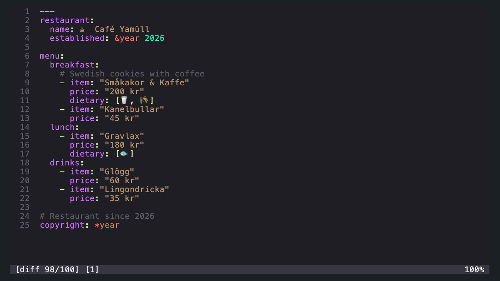
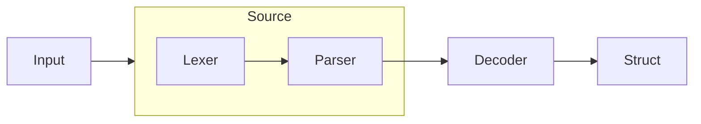

<p align="center">
  <h1 align="center">Nice YAML!</h1>
</p>

<p align="center">
  <a href="https://pkg.go.dev/go.jacobcolvin.com/niceyaml"></a>
  <a href="https://goreportcard.com/report/go.jacobcolvin.com/niceyaml"></a>
  <a href="https://codecov.io/gh/macropower/niceyaml"></a>
  <a href="#installation"></a>
  <a href="https://github.com/macropower/niceyaml/blob/main/LICENSE"></a>
</p>

Package `niceyaml` combines the powers of [go-yaml][goccy/go-yaml], [bubbletea][bubbletea], and more.

It enables **friendly and predictable handling of YAML-compatible documents** in your **CLI** or **TUI** applications, and includes:

- [`line.View`][niceyaml/line.View] **style overlay** and **annotation** system over a [`Source`][niceyaml.Source]
- Pretty [`printer`][niceyaml/printer] with [themes][niceyaml/style/theme]
- Rich [`Error`][niceyaml.Error] display using the above systems
- Source [**diffs**][niceyaml/diff] between revisions of a file
- String [`finder`][niceyaml/finder] for load-once, search-many scenarios
- [`Node`][niceyaml.Node] decoding with validation hooks, and a matching [`encoder`][niceyaml/encoder]
- JSON schema [validation][niceyaml/schema.Schema] with YAML path errors
- Bubble [`yamlviewport`][niceyaml/bubbles/yamlviewport] for Bubble Tea, in a module of its own
- [`fangs`][niceyaml/fangs] adapters for CLIs built with fang, in a module of their own
- Generic building blocks for your own bubbles

We use a **parse-once**, **style-once** approach. This means your users get a snappy UI, and you get a simple API. There's no need to employ multiple lexers, or perform any ANSI manipulation!

Every part of `niceyaml` shares one consistent **positioning system**. It addresses each cell on its own, and the display mode, such as a diff or a slice, adds no complexity.

## Features

### Search


### Revision Diffs



### Themes


### Validation


## Installation

```sh
go get go.jacobcolvin.com/niceyaml@latest
```

`niceyaml` requires Go 1.27 or later, since `Decode[T]` on `Source`,
`Node`, and `Layers` is a generic method, which Go 1.27 introduced.

## Usage

### Core Abstractions

Module `niceyaml` adds a few abstractions on top of [go-yaml][goccy/go-yaml]:

- [`line.Line`][niceyaml/line] - Tokens for a single line of YAML content
- [`line.Lines`][niceyaml/line] - A collection of `Line`s, which never changes after creation
- [`line.View`][niceyaml/line] - One rendering of a `Lines` value, which carries the overlays, annotations, and flags the printer draws
- [`niceyaml.Source`][niceyaml.Source] - A YAML file, which parses into one `Node` per document, decodes, wraps errors, exposes its `Lines`, and returns fresh `View`s over them

Most use cases will only need to interact with `Source`. Its `Lines` method returns the `line.Lines` that the [`finder`][niceyaml/finder] and [`diff`][niceyaml/diff] packages read, and its `View` method returns a fresh `line.View` over them for the [`printer`][niceyaml/printer]. Both packages read a view too, so a search or a diff of one document takes the `View` of its `Node` and reports the lines of the file. Diffs return plain views, since interleaved lines from two revisions are not a YAML document. A program that edits a file in place reads the bytes of the file from `Text` and converts a position to a byte offset in them with `Offset`.

These abstractions let you iterate over arbitrary lines of tokens from one or more YAML documents, and they keep the original token details from the lexer. Multi-line and overlapping tokens cause common problems in diffs, partial rendering, and search, and these abstractions solve them.


```mermaid
flowchart LR
    A["Input"]
    subgraph Source
        B["Lexer"] --> C["Parser"]
    end
    A --> Source
    C --> D["Decoder"]
    D --> E["Struct"]
```

### Printer

- [examples/printer](examples/printer)

### Diffs

- [examples/diffs](examples/diffs)

### Finder

- [examples/finder](examples/finder)

### Schemas

- [examples/schemas/cafe](examples/schemas/cafe)

Types declare their constraints with `jsonschema` struct tags. The `gen` tool from [go.jacobcolvin.com/x/jsonschema](https://pkg.go.dev/go.jacobcolvin.com/x/jsonschema) turns them into [cafe.v1.json](examples/schemas/cafe/cafe.v1.json). Run `go run ./examples/schemas/cafe/demo` to validate a config against that schema and render any failures as source-annotated errors.

### Layers

[`niceyaml.Layers`][niceyaml.Layers] merges several files into one document, such as a base file with the file of one environment over it, and decodes that document once. Pass the [`Source`][niceyaml.Source] of each file, lowest first:

```go
base, err := niceyaml.NewSourceFromFile("base.yaml")
if err != nil {
	return err
}

prod, err := niceyaml.NewSourceFromFile("prod.yaml")
if err != nil {
	return err
}

cfg, err := niceyaml.NewLayers(base, prod).Decode[Config](ctx, niceyaml.WithValidator(schema))
```

- A mapping merges into the mapping of the file below it, key by key and at every depth, so `prod.yaml` changes one field of one entry of a map and keeps the rest of `base.yaml`.
- A sequence or a scalar replaces what the file below holds.
- A null keeps what the file below holds, so a key whose entries are all commented out changes nothing.
- Each file resolves its own aliases and `<<` merge keys before it merges.

Validators and self-validation run on the merged document, so a schema that requires a key passes when any file sets it. Each error reports the file and the line that hold its value:

```text
base.yaml:3:9: $.server.port: port must be at least 1
```

The decode fills the Go value from the merged document as any decode does, so defaults the value holds survive where the files leave a field out.

A nil layer adds nothing, so a file that may be missing goes in as it is:

```go
user, err := niceyaml.NewSourceFromFile(userPath)
if err != nil && !errors.Is(err, fs.ErrNotExist) {
	return err
}

cfg, err := niceyaml.NewLayers(base, prod, user).Decode[Config](ctx, niceyaml.WithValidator(schema))
```

A [`Node`][niceyaml.Node] is a layer too, for one document of a file that holds several, or for the part of a document that `Node.At` returns. A program that collects its layers in a loop holds them in a `[]niceyaml.Layer`, since Go spreads neither a `[]*Source` nor a `[]*Node` into `NewLayers`.

`Layers.Document` returns the merged document as a [`Node`][niceyaml.Node], and its errors still report the file and the line that hold each value. One value of the files then decodes on its own, and the merged text prints as any document does:

```go
doc, err := niceyaml.NewLayers(base, prod).Document()
if err != nil {
	return err
}

kind, err := doc.DecodeAt[string](ctx, paths.Doc().Child("kind"))
```

Every `Node` of the merged document has the file path of the lowest layer. `Node.Origin` returns the `Node` that holds a value in the file of its layer, so a validator that reads a path beside that file finds its directory.

The environment and the flags of a program go in as one more layer. Encode a map of the keys they set with [`encoder.Marshal`][niceyaml/encoder] and pass a `Source` of the result above the files. The schema then checks those values too, and an error under one reports that layer:

```go
data, err := encoder.Marshal(ctx, map[string]any{"server": map[string]any{"port": port}})
if err != nil {
	return err
}

env := niceyaml.NewSourceFromBytes(data,
	niceyaml.WithName("environment"), niceyaml.WithExcerpts(false))

cfg, err := niceyaml.NewLayers(base, prod, env).Decode[Config](ctx, niceyaml.WithValidator(schema))
```

```text
environment:2:9: $.server.port: port must be at least 1
```

The environment holds secrets, and the excerpt of an error shows the lines around it. `WithExcerpts(false)` marks the text of that layer as one no error may show, so an error there prints its position, its path, and its message, and no line of the layer. An error in a file keeps its excerpt.

The docs of [`Layers`][niceyaml.Layers] say what such a layer cannot do, such as unset a value.

### Viewport

See [cmd/nyaml](cmd/nyaml) for a complete Bubble Tea application that loads, pages, searches, diffs, and validates YAML documents.

[`yamlviewport`][niceyaml/bubbles/yamlviewport] builds on the public API of `niceyaml` alone, so your own bubble has every building block it uses. [`printer.Layout`][niceyaml/printer.Layout] maps each position to its row and cell, and [`printer.Cut`][niceyaml/printer.Cut] cuts a printed row to a window of those cells.

[goccy/go-yaml]: https://github.com/goccy/go-yaml
[lipgloss]: https://github.com/charmbracelet/lipgloss
[bubbletea]: https://github.com/charmbracelet/bubbletea
[go.jacobcolvin.com/x/jsonschema]: https://github.com/MacroPower/x/tree/main/jsonschema
[niceyaml.Error]: https://pkg.go.dev/go.jacobcolvin.com/niceyaml#Error
[niceyaml.Layers]: https://pkg.go.dev/go.jacobcolvin.com/niceyaml#Layers
[niceyaml.Node]: https://pkg.go.dev/go.jacobcolvin.com/niceyaml#Node
[niceyaml.Source]: https://pkg.go.dev/go.jacobcolvin.com/niceyaml#Source
[niceyaml/diff]: https://pkg.go.dev/go.jacobcolvin.com/niceyaml/diff
[niceyaml/encoder]: https://pkg.go.dev/go.jacobcolvin.com/niceyaml/encoder
[niceyaml/finder]: https://pkg.go.dev/go.jacobcolvin.com/niceyaml/finder
[niceyaml/line]: https://pkg.go.dev/go.jacobcolvin.com/niceyaml/line
[niceyaml/line.View]: https://pkg.go.dev/go.jacobcolvin.com/niceyaml/line#View
[niceyaml/printer]: https://pkg.go.dev/go.jacobcolvin.com/niceyaml/printer
[niceyaml/printer.Cut]: https://pkg.go.dev/go.jacobcolvin.com/niceyaml/printer#Cut
[niceyaml/printer.Layout]: https://pkg.go.dev/go.jacobcolvin.com/niceyaml/printer#Layout
[niceyaml/style/theme]: https://pkg.go.dev/go.jacobcolvin.com/niceyaml/style/theme
[niceyaml/style/kind.Kind]: https://pkg.go.dev/go.jacobcolvin.com/niceyaml/style/kind#Kind
[niceyaml/bubbles/yamlviewport]: https://pkg.go.dev/go.jacobcolvin.com/niceyaml/bubbles/yamlviewport
[niceyaml/fangs]: https://pkg.go.dev/go.jacobcolvin.com/niceyaml/fangs
[niceyaml/schema.Schema]: https://pkg.go.dev/go.jacobcolvin.com/niceyaml/schema#Schema
